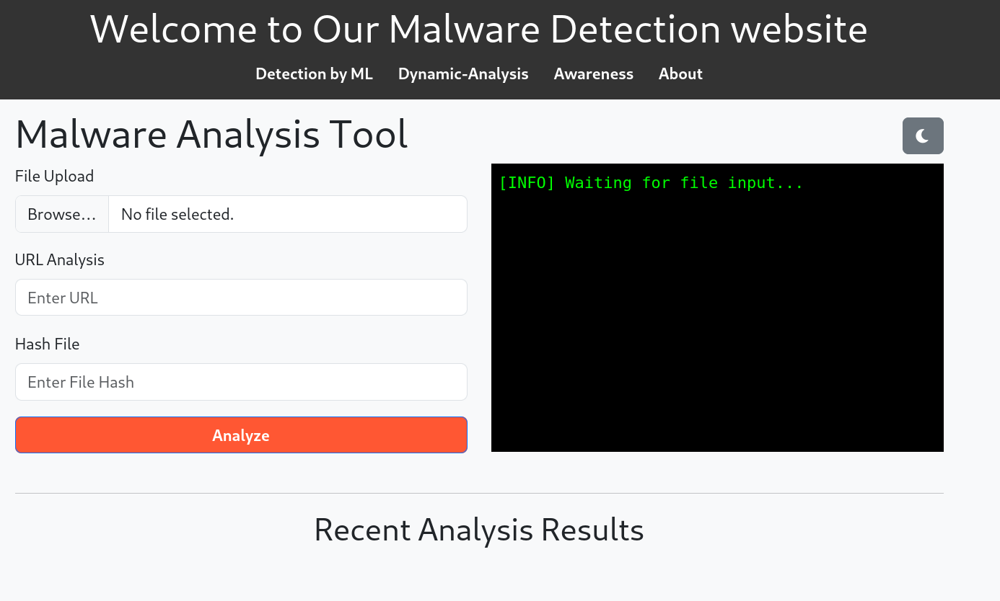
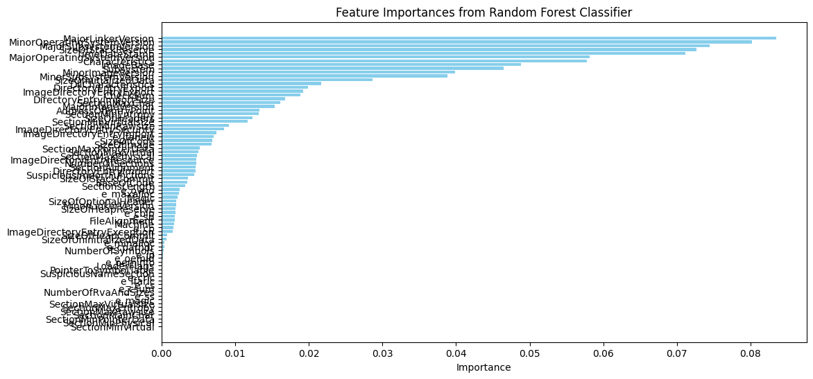
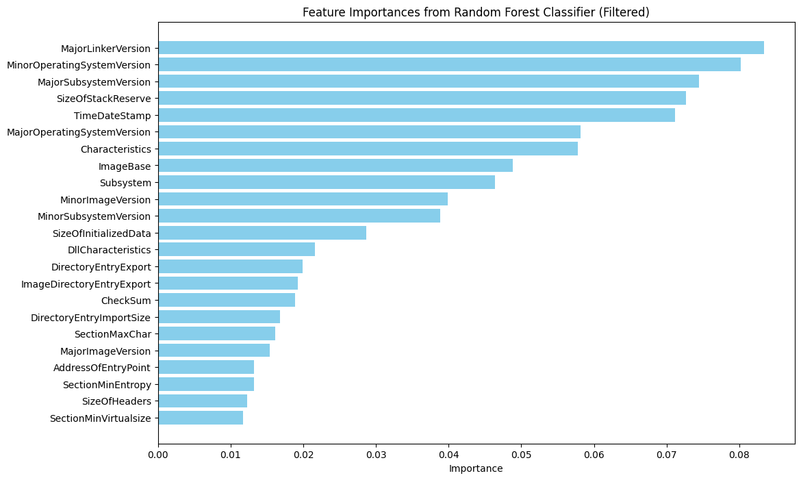
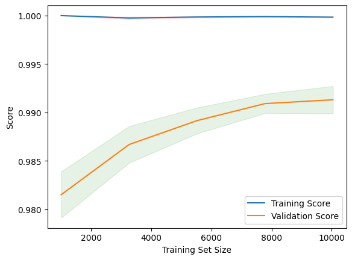
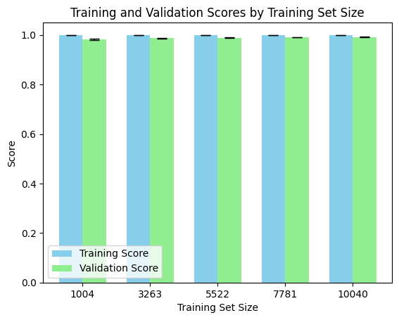

# Malware Analysis Web Application

Malware Detection and Analysis using Machine Learning WebApp is a robust tool designed to provide users with an intuitive interface for analyzing and detecting malware in various file formats. This web app leverages both static analysis through the API and advanced machine learning techniques to ensure comprehensive threat assessment. MDAML is created to address the need for an accessible and user-friendly platform that enables efficient malware analysis for files, URLs, and executables.

## Table of Contents

- [Features](#features)
  --[Static Analysis using API](#Static-Analysis-using-API)
  --[Machine Learning-Based Detection](#Machine-Learning-Based-Detection)

- [Technologies Used](#technologies-used)
- [Feature Selection and Model Training](#feature-selection-and-model-training)
- [File Types Supported](#file-types-supported)
- [DEMO](#demo)
- [Contributing](#contributing)
- [License](#license)

## Features

### Static Analysis using API
- Allows quick, static analysis of files, URLs, and hashes by leveraging VirusTotal’s extensive threat intelligence database.
- This tool integrates two key methods to detect potential threats, providing users with a comprehensive approach to assess security risks.

### Machine Learning-Based Detection
- Focused on executable files (.exe and .dll), using machine learning and feature extraction to identify malicious behavior.

## Technologies Used

- Python
- Flask
- scikit-learn
- pandas
- pefile
- Joblib

## Feature Selection and Model Training

### Selection of Features According to Their Importances

Using a Random Forest Classifier, we evaluated the importance of different features to identify the most significant ones for malware detection. By filtering the features based on their importances, we set a threshold to select only the most relevant features for training our model. This approach enhances the model's efficiency and accuracy.
### Before Selection of Features According to Their Importances
 

### After Selection of Features According to Their Importances

### Training a New Model Based on Important Features

After selecting the important features, we trained a new model, which yielded the following classification metrics:

| Class    | Precision | Recall | F1-Score | Support |
|----------|-----------|--------|----------|---------|
| Benign   | 1.00      | 0.97   | 0.98     | 1003    |
| Malware  | 0.99      | 1.00   | 0.99     | 2920    |
| **Accuracy**     | **0.99**  |        |          | **3923**    |
| Macro Avg| 0.99      | 0.98   | 0.99     | 3923    |
| Weighted Avg| 0.99   | 0.99   | 0.99     | 3923    |

**Training Scores:**  
The average training score is approximately 99.13%.

**Validation Scores:**  
The average validation score is around 98.63%.

The results demonstrate high performance for both training and validation sets, with only a slight discrepancy of 0.51%.

### Analysis

- **No Overfitting:** The close alignment of training and validation scores indicates that the model is likely not overfitting. In cases of significant overfitting, we would expect a higher training score compared to the validation score.
  
- **Slight Underfitting Possibility:** While the validation score is marginally lower than the training score, indicating a slight potential for underfitting, the difference is minimal.

### Learning Curves

To assess the model's performance over different training set sizes, we generated learning curves. These curves help visualize how the model's accuracy evolves as more training data is added.

 

### Training and Validation Scores by Training Set Size

The bar chart below displays the average training and validation scores along with their standard deviations across various training set sizes.

---

By analyzing these scores and visualizations, we gain insight into the model's learning behavior and can make informed decisions for further improvements.

## DEMO

## File Types Supported

    Executable files: .exe, .dll
    Archive files: .zip, .tar

## Contributing

Contributions are welcome! If you'd like to contribute, please follow these steps:

    Fork the repository.
    Create a new branch (git checkout -b feature/YourFeature).
    Make your changes and commit them (git commit -m 'Add some feature').
    Push to the branch (git push origin feature/YourFeature).
    Open a pull request.

License

This project is licensed under the MIT License. See the LICENSE file for details.
